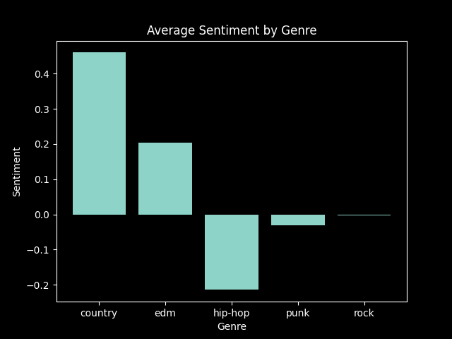
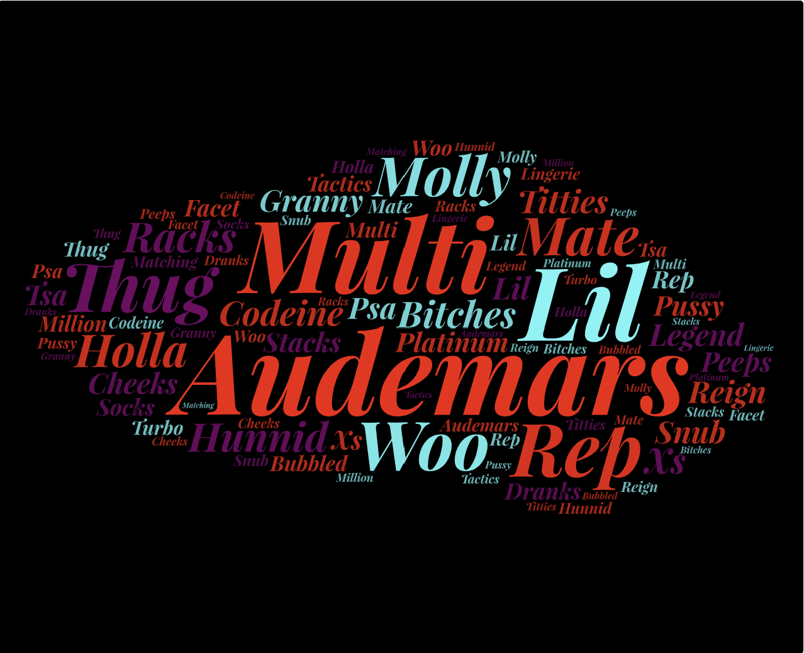
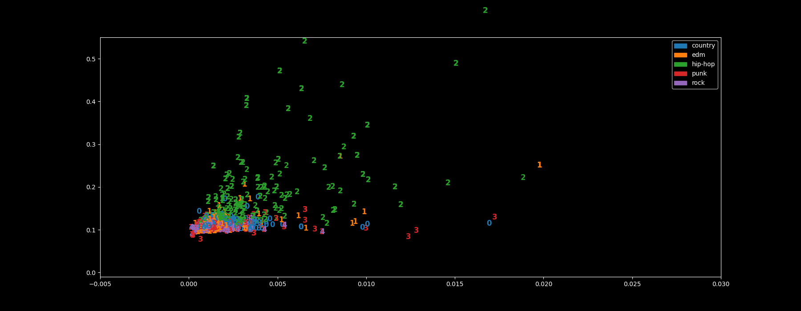
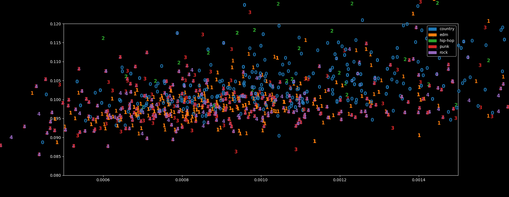
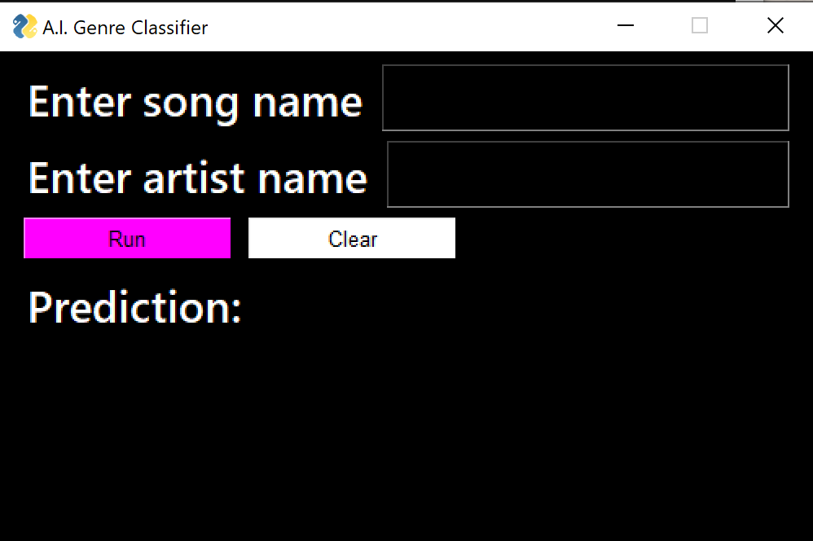
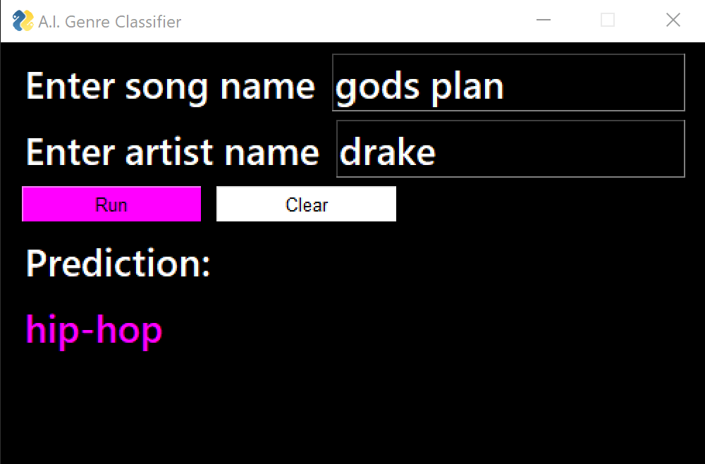

# Music Genre Classification

### Background

Music tends to be split by genre (which are usually split into subgenres as well), so we are going to analyze how lyrics can possibly be used to predict what genre of music a certain song is.

## EDA

Currently, this project contains about 6,000 songs. Once we split these songs into 5 genres, we are left with 519 songs per genre. We use the minimum number of songs in a genre to make sure all genres are as balanced as possible.

1. **Collecting Data**

- To begin collecting data, I hardcoded the names of many artists into a list. For each artist in this list we are able to get their top 50 tracks using the [Last FM API](https://www.last.fm/api). The Last FM API also returned corresponding genres for each song. Using the artist name and song name, we were then able to find the lyrics on [AZLyrics](https://www.azlyrics.com/). These lyrics are then cleaned of any source code text, as well as other non-letter characters. This data is written into a txt file in this format: `song name|artist name|lyrics|genre`.

2. **Analyzing Data**

- With over 6,000 songs stored, we're ready to do some EDA and analyze our data. With lyrics there are two main analyses we can do: sentiment analysis and word clouds.
Using NLTK's sentiment library, we were able to get the mean sentiment for each genre which can be seen below:


- We were also able to build word clouds for each of our genres. To view all word clouds, [click here](https://github.com/cezar-r/music_genre_identifier/tree/main/images).



## Modeling

For this problem, I utilized several machine learning models from [SKLearn](https://scikit-learn.org/stable/). These are the models that were used:
  * Logistic Regression
  * Bernoulli Naive Bayes
  * Multinomial Naive Bayes
  * Random Forest Classifier
  * SGD Classifier
  * SVC
  * Linear SVC
  * NuSVC

1. **Fitting the Data into Models**

- These models are normally fit with numerical values rather than words, so our data needs to be converted. The normal approach is to use a TFIDF and vectorize it, however SKLearn simiplifies this for us with the SKLearn Classifier object. This object simply takes in a model as well as `data`. `data` is lyric and genre data, which usually gets split into `X_train, X_test, y_train, y_test`. However `data` needs to be organized in a way such that we have a dictionary where the keys are our vocabulary and the values are a boolean value of whether or not that word appears in our current sample. This dictionary is fit inside of a tuple, where the second value represents the genre. `data` is a list of these tuples. Here is a visualization to assist with this:
```python
data = [(
         {
         keyword1: True,
         keyword2: False,
         keyword3: True
         },
         genre1
        ),
        (
         {
         keyword1: True,
         keyword2: False, 
         keyword3: False
         },
         genre2
        )]

# 80-20 test train split
data_train = data[ : .8 * len(data)]
data_test = data[.8 * len(data) : ]

classifier = SklearnClassifier(model) 
classifier.train(data_train)
score = nltk.classify.accuracy(classifier, data_test)       
score_proba = nltk.classify.log_likelihood(classifier, data_test)
```

2.  **Running the Models**

- To get the best results we possibly can, our data is run over every single model. After doing this, I used an ensemble (or voting system) using each of these models to cast a vote. The mode of the votes is the final guess for the ensemble model. 


## Results

After running these models through several iterations, these were the accuracy scores of each model on unseen data:

  * Bernoulli Naive Bayes -> 63.78%
  * Linear SVC -> 62.68%
  * SVC -> 62.05%
  * NuSVC -> 62.05%
  * Logistic Regression -> 62.05%
  * Multinomial Naive Bayes -> 60.16%
  * SGD Classifier -> 60.07%
  * Random Forest Classifier -> 59.82%
  * Voting System -> 64.88%

These results are not spectacular by any means, however it is important to keep in mind the baseline for this is 20% (randomly guessing 1 of the 5 genres). 
We can also see where the models might be getting confused with classification.


Let's zoom in on that cluster


As you can see, clustering these genres with known information is already difficult enough. We can see how 4 out of the 5 genres are located in this tight cluster. With classification as difficult as this, I believe an accuracy of 64% is actually pretty solid.


## Outlook

Moving forward, there are a few things that can be done to improve the accuracy of these models:
- Get more data -> at least 2,000 songs per genre
- Consult music experts on how to better group subgenres to genres -> is "country rock" country or rock?
- Clean lyrics even more -> even after 3 cleaning stages, there were many words with non-letter characters attached to them.


## Running the GUI

To start the GUI, simply open the src directory in the command line and run the command `python run_gui.py`. Make sure you have all libraries installed as well (found below). If you do not have a model.pickle file already, go into src/lyric_predicting and run main(run_models = True) followed by main(test_models = True). This process can take up to an hour depending on your hardware.

 


## Technologies used
- Pandas
- Numpy
- Matplotlib
- Statistics
- Pickle
- SKLearn
- NLTK
- PySimpleGUI
- JSON
- Requests
- Urllib
- BeautifulSoup


